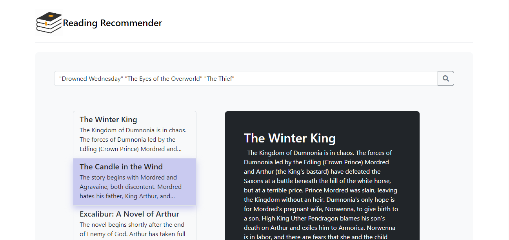

# Sistema de Recomendación de Libros

# Informe de Proyecto

## Autores

- [Brian Ameht Inclan Quesada](https://github.com/Usytwm)
- [Eric Lopez Tornas](https://github.com/EricTornas)

## Descripción del Problema

El proyecto busca desarrollar un sistema de recomendación de libros que pueda sugerir libros similares a uno dado, basado en las reseñas y títulos de los libros. Esto se orienta a mejorar la experiencia de los usuarios en plataformas de lectura, ofreciéndoles opciones personalizadas acorde a sus intereses.

## Consideraciones Tomadas

Durante el desarrollo se consideró:

- La importancia de un preprocesamiento eficiente del texto para mejorar la calidad de las recomendaciones.
- La elección del modelo TF-IDF para la vectorización del texto y la descomposición SVD para reducir la dimensionalidad.
- La necesidad de calcular la similitud del coseno para identificar libros con contenido similar.
- La escalabilidad y eficiencia del sistema al manejar grandes conjuntos de datos.

## Requisitos Previos

Antes de seguir los pasos para ejecutar el sistema de recomendación, asegúrate de tener instalado lo siguiente en tu máquina:

### Software y Herramientas

- **Git**: Necesario para clonar el repositorio del proyecto. Si no lo tienes instalado, puedes descargarlo desde [https://git-scm.com/](https://git-scm.com/).
- **Python**: El proyecto requiere Python para ejecutar el backend y las dependencias. Asegúrate de tener Python 3.8 o superior. Puedes descargarlo desde [https://www.python.org/downloads/](https://www.python.org/downloads/).
- **npm**: Necesario para instalar las dependencias de Angular para la interfaz gráfica. npm viene incluido con Node.js, que puedes obtener desde [https://nodejs.org/](https://nodejs.org/).

### Verificación de la Instalación

Para verificar que las herramientas necesarias están instaladas correctamente, puedes utilizar los siguientes comandos en tu terminal o línea de comandos:

- Para **Git**:

  ```bash
  git --version
  ```

- Para **Python**:

  ```bash
  python --version
  ```

- Para **npm** y **Node.js**:

  ```bash
  node --version
  npm --version
  ```

Si los comandos anteriores retornan las versiones de las herramientas, significa que ya están instaladas correctamente y se puede proceder con la ejecución del proyecto.

## Ejecución del Proyecto

Para ejecutar el sistema de recomendación, sigue los siguientes pasos:

1. Clona el repositorio:
   ```bash
   git clone https://github.com/recommendation-system.git
   cd recommendation-system
   ```
2. Instala las dependencias:
   ```bash
   pip install -r requirements.txt
   ```
3. Instala las dependencias de angular:

   ```bash
   cd gui/ReadingRecommender
   npm install
   ```

4. Dirigete a la carpeta principal y ejecuta el startup.bat con el siguinte comando
   ```bash
   ./startup.bat
   ```

## Explicación de la Solución

El sistema se compone de varios módulos:

- Preprocesamiento: Utiliza PreprocessingUtils para limpiar y preparar los datos de texto, eliminando caracteres no deseados y normalizando el texto.

- Modelo TF-IDF: Convierte el texto en vectores numéricos que representan la importancia de las palabras en los documentos, utilizando TfidfModel.

- Modelo de Similitud: Emplea SimilarityModel para calcular la similitud entre libros usando el kernel lineal sobre los vectores TF-IDF.

- Sistema de Recomendación: RecommendationSystem utiliza el modelo de similitud para encontrar y recomendar libros similares basándose en un título específico.

- El flujo del sistema inicia con la carga de datos, seguido por el preprocesamiento, la vectorización TF-IDF, el cálculo de similitudes y, finalmente, la generación de recomendaciones.

## Cómo Realizar Consultas en el Sistema

Para asegurar resultados precisos al usar el sistema de recomendación, es importante seguir el formato correcto al introducir las búsquedas. A continuación, se muestran las pautas sobre cómo formular las consultas:

### Formato de Consulta

- **Uso de Comillas**: Encierra cada término de búsqueda entre comillas dobles (`" "`).
- **Separación por Espacios**: Separa diferentes términos de búsqueda con un espacio.

### Ejemplo de Consulta

Si deseas buscar recomendaciones relacionadas con los titulos "Drowned Wednesday" "The Eyes of the Overworld" "The Thief", deberas escribir la consulta de la siguiente manera en el buscador:

```arduino
 "Drowned Wednesday" "The Eyes of the Overworld" "The Thief"
```

### Ilustración de Ejemplo

A continuación, se muestra un ejemplo visual de cómo se veria esta consulta en el buscador:



## Insuficiencias y Mejoras Propuestas

El sistema actual, aunque funcional, podría mejorar en aspectos como:

- Integración de un componente de aprendizaje automático para ajustar las recomendaciones basadas en retroalimentación del usuario.
- Expansión del conjunto de datos para incluir más características de libros, como género o autor, para afinar las recomendaciones.
- Optimización de la eficiencia en el manejo de grandes volúmenes de datos.

## Dependencias del Proyecto

Las dependencias están listadas en requirements.txt, generado con el siguiente comando:

```bash
pip freeze > requirements.txt
```
